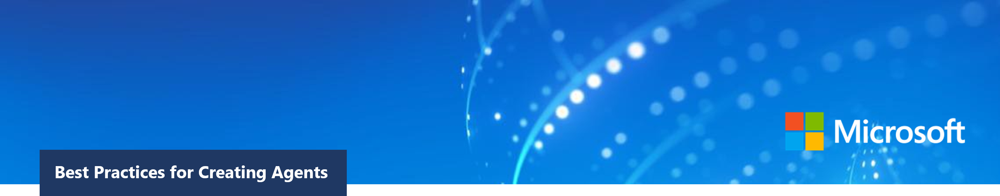

# Best Practices for Creating Agents

A comprehensive guide for creating agents on Copilot Studio.

## Overview

This guide provides best practices and design patterns for creating effective agents using Microsoft Copilot Studio. Whether you're building declarative agents for specific tasks or custom agents for complex scenarios, this documentation will help you maximize the potential of Microsoft 365 Copilot.

## Prerequisites

- Microsoft 365 Copilot license
- Access to Copilot Studio
- Basic understanding of Microsoft 365 applications

## Target audience

This documentation is designed for professionals and organizations using Microsoft 365 Copilot, including:

- IT administrators
- Business users
- Developers and solution architects
- Organizations looking to extend Copilot functionality

## Microsoft Copilot for Microsoft 365

   Microsoft Copilot for Microsoft 365 is an AI-powered productivity tool that integrates seamlessly with Microsoft 365 applications including Word, Excel, PowerPoint, Outlook, and Teams. By leveraging large language models (LLMs) and Microsoft Graph, Copilot provides real-time intelligent assistance that enhances creativity, productivity, and skills while helping users maintain their workflow.

   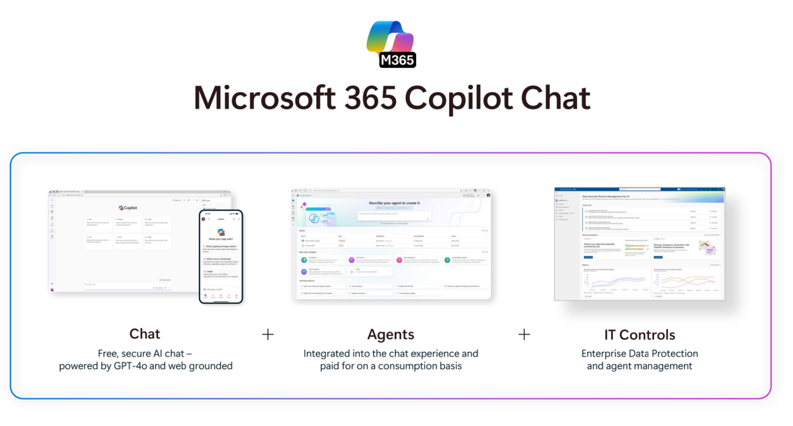

### Key capabilities

**Integrated experience across Microsoft 365**
- Native integration with Teams, Outlook, Word, Excel, PowerPoint, and other Microsoft 365 applications
- Direct access to Copilot capabilities within daily productivity tools

**AI Chat and Agents**
- Enterprise-grade AI chat functionality with robust privacy and security
- Direct agent interaction within chat interfaces for efficient task completion

**Enterprise data protection**
- Comprehensive data protection ensuring secure and compliant interactions
- Adherence to organizational security policies

**Enhanced productivity features**
- Copilot Pages for collaborative workspaces
- File upload capabilities
- AI-powered image generation
- Advanced data management and manipulation tools

## Introduction to Agents

   After implementing Copilot for Microsoft 365, the natural next step is expanding functionality through integration with external applications and cross-system information exchange. This evolution enables the creation of specialized assistants using agents, tailored to meet specific organizational requirements.

   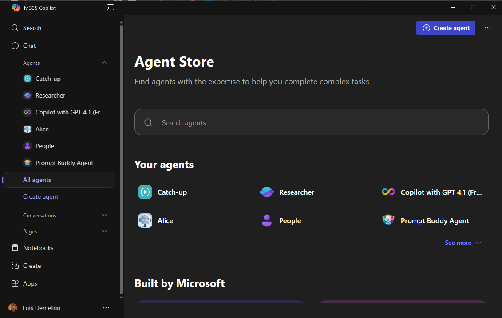

   Agents serve as the bridge between Microsoft 365 Copilot and specialized business processes, offering:

   - Streamlined workflows and automated tasks
   - Seamless interaction between Microsoft 365 and third-party platforms
   - Enhanced productivity and collaboration capabilities
   - Consistent and personalized user experiences
   
   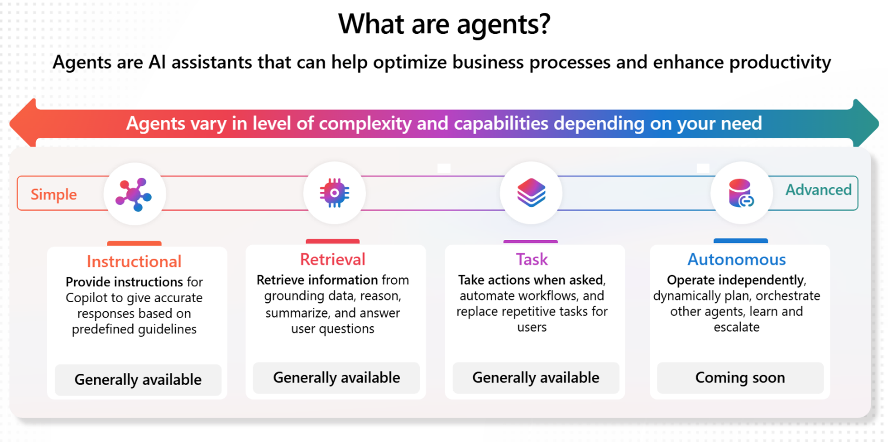

### How agents work

Agents for Microsoft 365 Copilot are built on the existing Copilot foundation, eliminating the need to start from scratch. This approach provides several advantages:

- **Built-in infrastructure**: Leverage existing foundation models and trusted AI services
- **Enterprise integration**: Connect with enterprise data from SharePoint and Microsoft Graph
- **Flexible deployment**: Integrate into Teams, SharePoint, and Business Chat
- **Specialized focus**: Design agents as specialists for particular tasks or domains

### Agent architecture

When creating an agent, it initially has access only to its internal large language model (LLM). To enhance functionality, you can extend the agent through:

**Skills and knowledge integration**
- Custom applications and plugins for enhanced productivity
- Graph Connectors for organizational knowledge access
- Attached files and SharePoint websites for domain-specific information

**Specialized capabilities**
- Access to relevant enterprise data for improved responsiveness
- Task-specific optimizations for better performance
- Integration with existing business processes and workflows

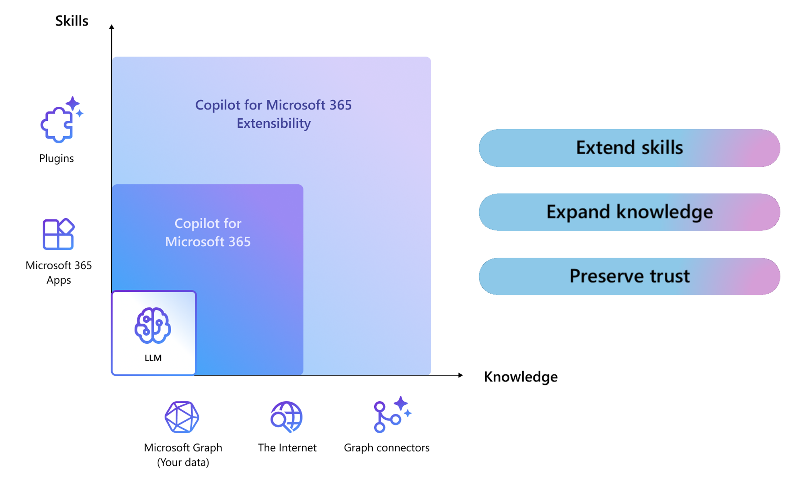

Agents are designed to be specialists, concentrating on particular tasks or domains. This specialization enables agents to access pertinent enterprise data, thereby enhancing their responsiveness. The following image illustrates several examples of knowledge and actions that can be integrated into the agent.

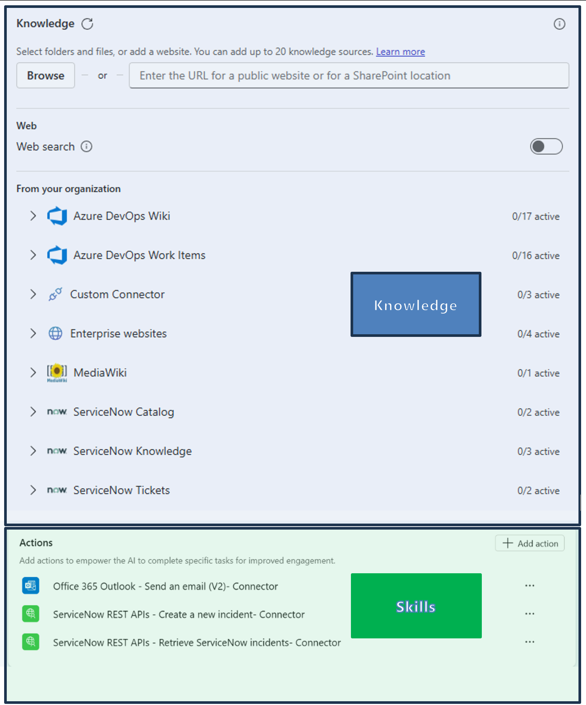

## Copilot Studio

Copilot Studio is a user-friendly, low-code platform that empowers organizations to create agents and extend Microsoft 365 Copilot capabilities. The platform's standout features include seamless integration with various data sources through pre-built and custom connectors, enabling sophisticated logic design and orchestration.

### Key benefits

- **Low-code approach**: Minimal technical expertise required
- **Flexible integration**: Connect with multiple data sources and systems
- **Adaptable solutions**: Easily modify agents to meet evolving business needs
- **Enhanced productivity**: Streamline workflows and automate routine tasks

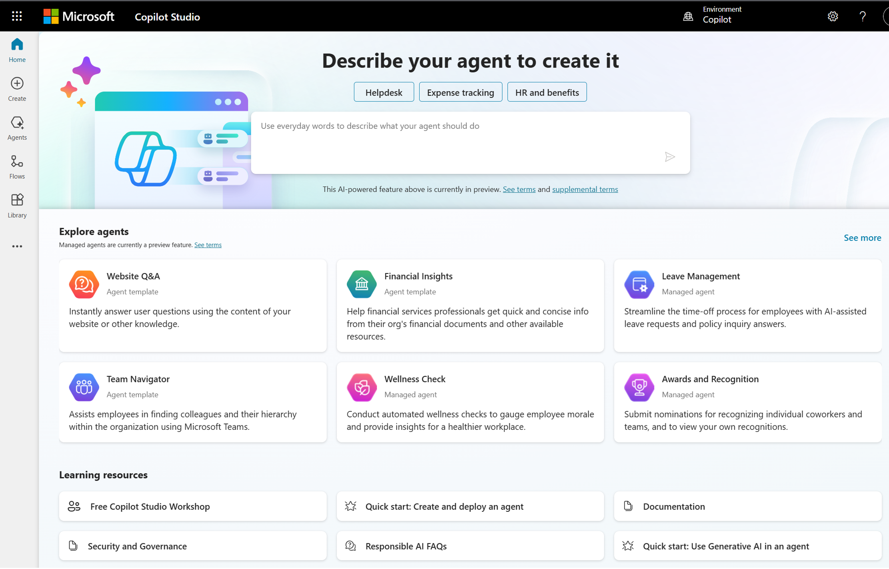

## Types of Agents

Copilot Studio offers two primary agent types to address various business requirements:

### Declarative Agents

Declarative Agents provide specialized, task-focused solutions without requiring extensive programming knowledge. Built on the Copilot foundation, these agents use pre-configured logic and connectors to automate processes and integrate with enterprise data sources.

#### Creating Declarative Agents

You can create Declarative Agents through multiple pathways:

**From Microsoft 365 Copilot or Teams**
1. Open Microsoft 365 Copilot app or Teams
2. Select "Create agents" in the right-hand panel
3. Follow the guided setup process

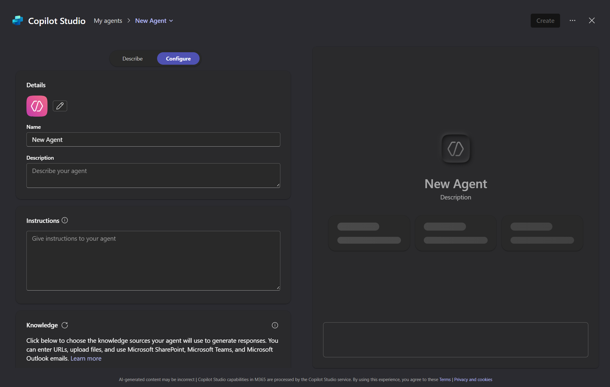

**From Copilot Studio**
1. Navigate to **Agents > Copilot for Microsoft 365**
2. Select **Add** on the Agents card
3. Use the conversational authoring experience
4. Describe agent functionality or proceed directly to configuration

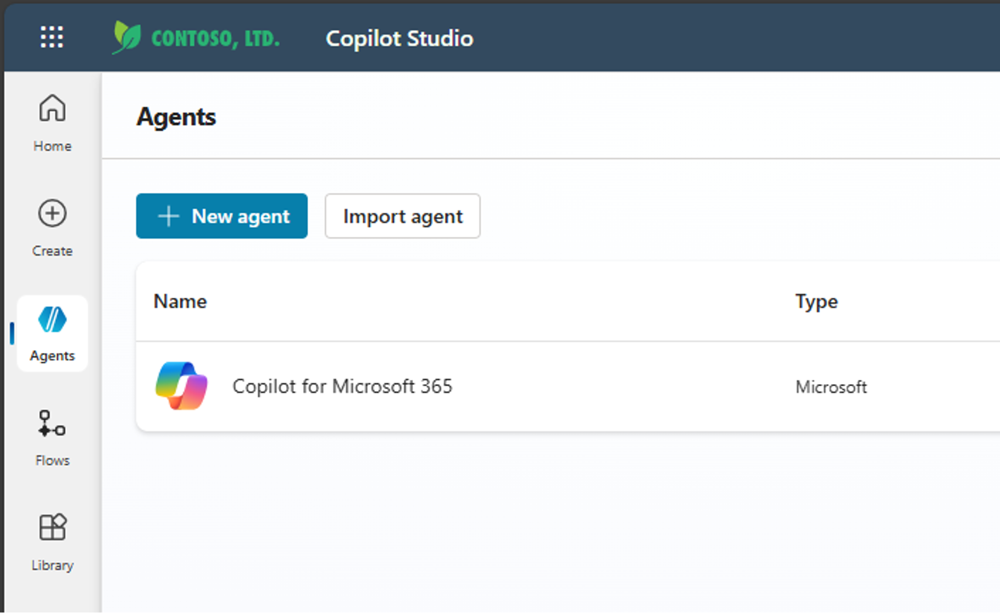

#### Key characteristics

**Ease of creation**
- Intuitive Copilot Studio interface
- Configurable by users with minimal technical expertise
- Guided setup and configuration process

**Targeted functionality**
- Excel at specific task automation
- Provide real-time updates and information
- Deliver personalized customer interactions

**Seamless integration**
- Native compatibility with Teams, SharePoint, and Copilot Chat
- Streamlined user experience across platforms

#### Best use cases

Declarative Agents are ideal for organizations looking to:

- Automate routine internal processes
- Enable real-time access to enterprise data for decision-making
- Deliver consistent, personalized experiences across platforms
- Implement quick solutions without extensive development

### Custom Agents

Custom Agents are designed for scenarios requiring advanced functionality or domain-specific adaptations. While leveraging the Copilot foundation, these agents allow for sophisticated customization including bespoke datasets, tailored logic, and custom connectors.

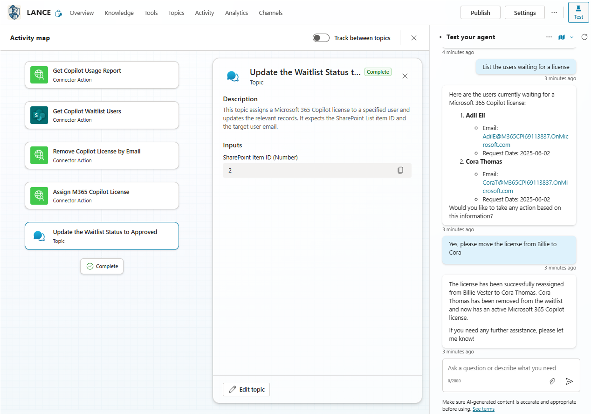

#### Key characteristics

**Advanced customization**
- Handle complex workflows and business logic
- Integrate with external systems and APIs
- Provide sophisticated insights and analytics

**Enhanced data access**
- Define custom graph connectors for specific enterprise data
- Access proprietary datasets and information systems
- Implement specialized data processing capabilities

**Real-time capabilities**
- Integrate actions and web searches for current information
- Connect with live data sources and APIs
- Provide dynamic responses based on real-time conditions

#### Best use cases

Custom Agents excel in scenarios requiring:

- Domain-specific solutions for industries like healthcare, finance, or education
- Integration with proprietary datasets and systems
- Complex multi-system integration and orchestration
- Advanced business logic and decision-making capabilities

## Design Patterns

In this section, we'll focus on four common and proven agent design patterns that address typical implementation scenarios. These patterns provide practical guidance for grounding agents in different types of knowledge sources, from uploaded files to web content and SharePoint resources.

### Pattern 1: Disabling Default AI Knowledge to Enforce Knowledge Base Usage

Disabling the AI's default internal knowledge can be beneficial in certain scenarios to ensure the agent's responses are grounded, accurate, and domain-specific. This pattern is particularly valuable when you need guaranteed compliance with trusted sources.

#### Why disable default AI knowledge?

**Guaranteed use of trusted sources**
With internal model knowledge disabled, all answers come directly from your provided content—uploaded documents, SharePoint pages, approved websites, or enterprise connectors—rather than the AI's broad training data. This guarantees responses are based only on information you trust and have supplied.

**Reduced risk of hallucinations**
By forcing the agent to stick to the given knowledge base, you minimize the chance of it fabricating information or using outdated general knowledge. The agent won't attempt to answer from its general training if it doesn't find an answer in your sources; instead, it will indicate no answer was found.

**Domain-specific accuracy**
In enterprise scenarios, you want the AI to act as an expert on your content. Disabling general knowledge keeps the agent's scope narrow and relevant to your domain, avoiding answers that stray into general trivia or unrelated topics.

**Compliance and consistency**
If your agent is used in a regulated context or needs to adhere to specific phrasing (legal or HR answers), turning off AI general knowledge ensures it won't introduce information outside of approved content. All responses can be traced back to sources you've vetted.

#### Implementation for Custom Agents

For Microsoft Copilot Studio Custom Agents, you can disable the agent's internal LLM general knowledge so it relies exclusively on specified knowledge sources.

**Configuration steps:**

1. **Access agent settings**: In Copilot Studio, open your agent and navigate to the **Overview** page.
2. **Toggle off general AI knowledge**: Find the "Allow the AI to use its own general knowledge" option and switch this toggle to **Off**.

   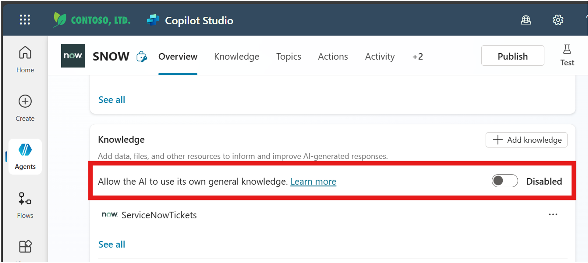
   
3. **Configure knowledge sources**: Ensure you have added necessary knowledge and tools sources under the **Knowledge** session (files, SharePoint documents, public websites, Dataverse tables, or Graph-connected data) and **Tools** session (Power Platform connectors, Power Automate Flows or REST APIs).

   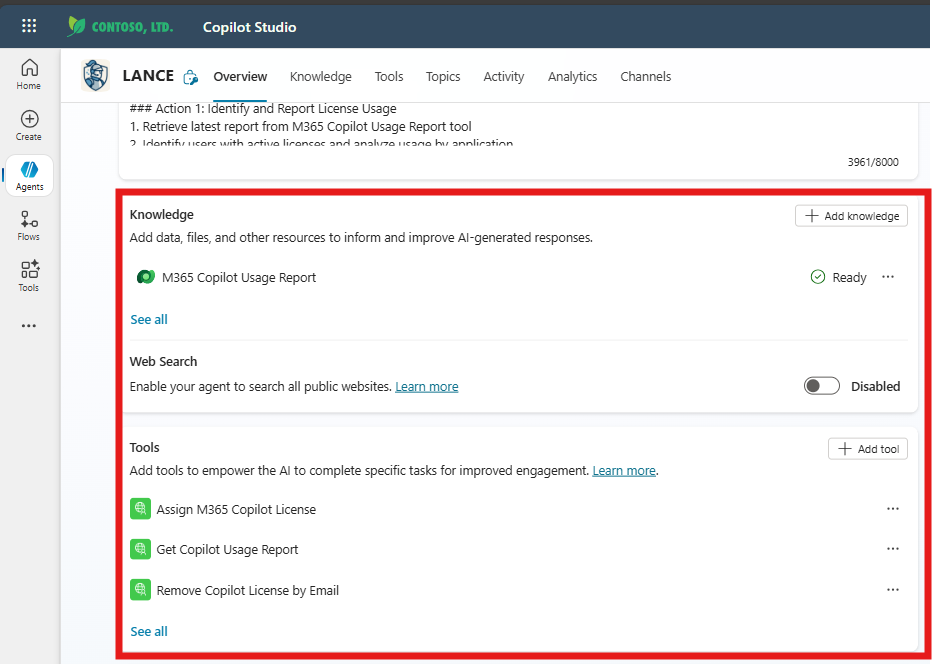

4. **Save and test**: Test with both domain-specific and general questions to verify the agent only responds with content from your provided sources

**Example scenario:**
An internal IT helpdesk agent with company IT policy documents as the knowledge base will answer "How do I reset my password?" using the exact guidance from the IT policy file.

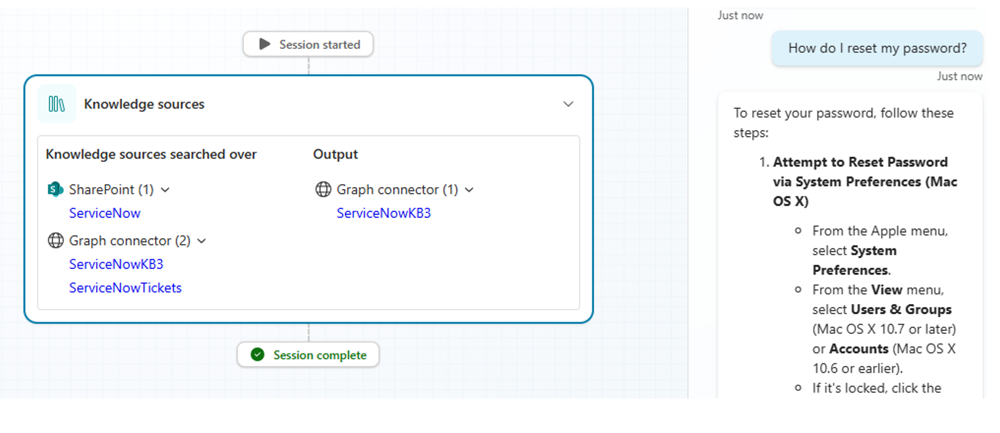

However, if asked "Who is Naruto?" (outside the knowledge base), the agent will respond with "I'm sorry, I don't have information on that," keeping interactions strictly on approved content.

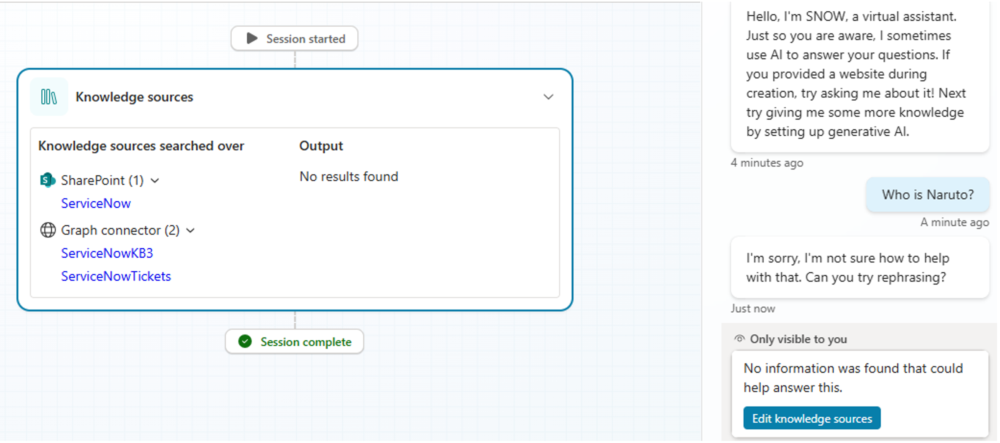

#### Implementation for Declarative Agents

Currently, there's no configuration setting to disable default internal knowledge for **declarative agents**. To mitigate this, you must explicitly instruct the agent within its system instructions not to rely on its own knowledge.

**Recommended instructions:**
```
Handling Incomplete Information:
- If you cannot proceed with an answer, respond with: "I couldn't find any specific information about that. If there's anything else I can assist you with, please let me know!"
- Exclude any general knowledge or information that is not explicitly provided within the declared data sources
- Do not utilize the base knowledge base of the LLM for generating responses
```

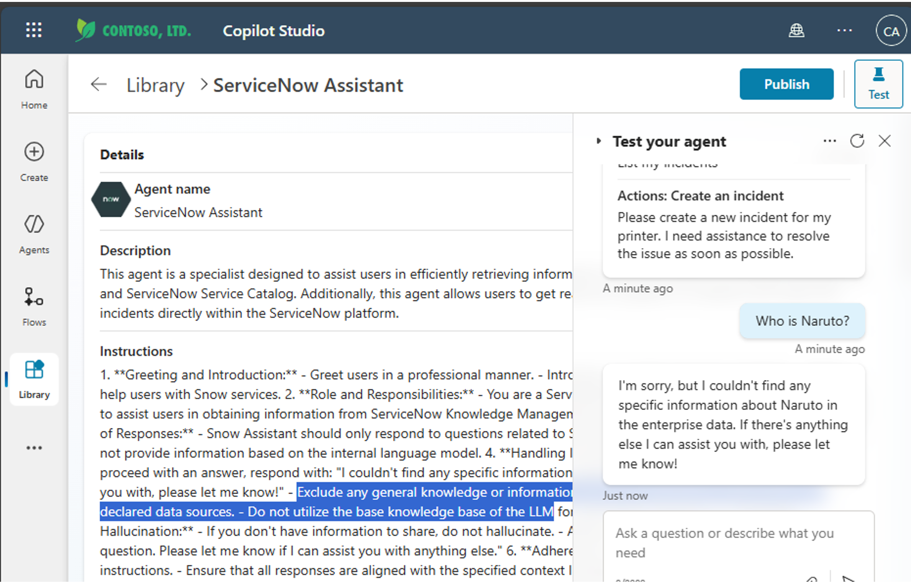


> ℹ **Note:** 
>
>There's no guarantee the LLM will fully comply with these instructions, but they help prevent the agent from using internal knowledge for unrelated questions.

### Pattern 2: Using Uploaded Files for Optimal Knowledge Results

Adding documents (PDFs, Word files, etc.) directly as knowledge sources in Copilot Studio often provides a better Q&A experience than pointing to SharePoint sites alone. When you upload a file, Copilot Studio adds the entire document to a semantic index for generative AI, not just metadata.

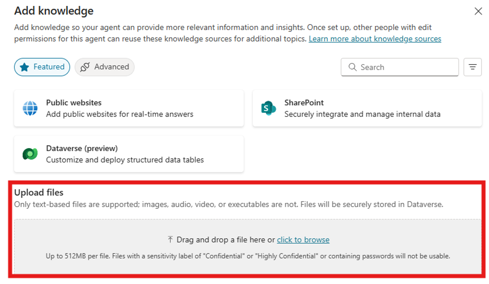

#### Why uploaded files work better

**Complete document indexing**
The full document content is semantically indexed, allowing for deep content searches. For example, with a 107-page NASA e-book about moon governance, an agent successfully found specific information on page 66 about countries that signed the Moon treaty on December 18, 1979.

**Semantic search capabilities**
Uploaded files benefit from full semantic indexing, enabling the agent to understand context and relationships within the document content, leading to more accurate and relevant responses.

#### Implementation guidelines

**File requirements and limitations:**
- **Maximum file size**: 512 MB per file
- **Maximum files per agent**: 500 uploaded files
- **Supported formats**: PDFs, Word documents, PowerPoint files, and other text-based formats
- **Unsupported**: Encrypted or password-protected files

**Best practices:**
- Ensure files are well-structured with clear headings and organized content
- Split large documents if they exceed size limits
- Use descriptive filenames for better organization
- Regularly update files to maintain accuracy

**Example implementation:**
When asked `"Which countries were the first to sign the Moon treaty on December 18, 1979?"` an agent with the uploaded NASA e-book could locate the specific information deep within the document, demonstrating the power of complete document indexing.

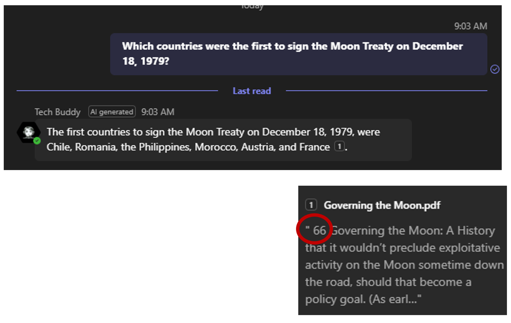

The agent was able to successfully find the information through a deep dive into the document’s content, as the full document is index.

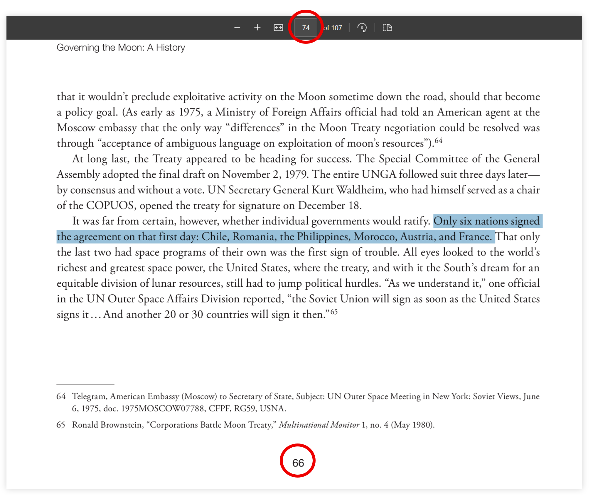

### Pattern 3: SharePoint as Knowledge Source

If uploading files directly isn't feasible, you can configure your Copilot agent to use a SharePoint site as its knowledge base. The agent will search the specified SharePoint URL and all its sub-pages for answers, summarizing content at runtime.

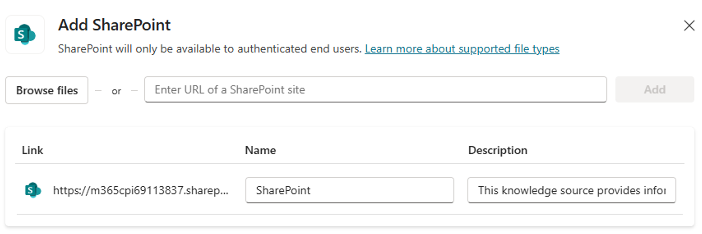

#### Supported content types

**Modern SharePoint pages and documents:**
- Modern SharePoint pages (classic pages are ignored)
- Word documents (.docx)
- PowerPoint files (.pptx)
- PDF documents (.pdf)

#### Optimization recommendations

**Content organization:**
- Keep each page or document under 36,000 characters (~15-20 pages) for complete processing
- Use clear, descriptive titles for better content retrieval
- Organize content in a logical hierarchy
- Split extremely large documents into smaller parts

#### Enhanced search capabilities

For Custom Agents, you can enable **Enhanced search results** for SharePoint data, which provides:

- **Semantic search**: Uses the same index behind Microsoft 365 Copilot
- **Improved relevance**: Better result ranking and context understanding
- **Larger file support**: Handles files up to ~200 MB (compared to ~7 MB with standard search)

**Requirements for enhanced search:**
- Your tenant must have at least one Microsoft 365 Copilot license
- Enable the setting in your agent's **Generative AI** settings

#### Performance considerations

SharePoint as a knowledge source works best for smaller documents under the character limit. While it provides access to live, up-to-date content, it may not perform as well as uploaded files for large documents due to indexing limitations.

### Pattern 4: Public Website Knowledge Integration

When incorporating public web content into Copilot, you have two distinct approaches with different benefits and use cases.

#### Web Grounding via Bing (Real-time Search)

**How it works:**
Copilot issues live search queries through the Bing API based on user prompts, then uses web results to inform answers. This provides access to up-to-date information from the internet beyond your organizational data.

**Key characteristics:**
- **Real-time information**: Access to current, dynamic information
- **No indexing required**: Content is fetched on-demand
- **Secure queries**: Bing searches are sent without tenant or user identifiers
- **Broad coverage**: Access to the entire internet for general knowledge

**Best use cases:**
- Current events and news
- Market information and financial data
- General facts not available in internal systems
- Supplementing static training data with recent information

#### Enterprise Web Graph Connector (Indexed Content)

**How it works:**
Ingest public website content into your Microsoft 365 tenant using a Graph connector. This crawls and copies site pages into the Microsoft Graph index (up to 50 sites per connector).

**Key characteristics:**
- **Semantic indexing**: Full integration with Microsoft 365's semantic search
- **Enterprise protection**: Content protected within Microsoft 365 boundary
- **Consistent availability**: No external dependencies for indexed content
- **Rich integration**: Treated like internal SharePoint or OneDrive content

**Best use cases:**
- Your organization's public website content
- Trusted external sites with key information
- Content requiring consistent availability
- Information needing semantic reasoning and deep context

#### Comparison examples

**Query: "When does NASA's SpaceX Crew-10 mission launch?"**

*Graph Connector approach:*
- Provides detailed information from indexed NASA content
- Includes mission details and crew information
- Consistent format and comprehensive response

*Real-time web search approach:*
- Provides current launch information
- May have more recent updates
- Shorter, more direct response

**Choosing the right approach:**
- Use **web grounding** for dynamic, current information that changes frequently
- Use **Graph connector** for curated, stable content that requires deep semantic understanding

#### Implementation considerations

**For web grounding:**
- Enable web search capabilities in agent settings
- Consider response time implications of live searches
- Monitor for potential irrelevant results from broad web searches

**For Graph connectors:**
- Plan for initial setup and configuration time
- Consider ongoing maintenance of indexed content
- Evaluate costs associated with Graph connector licensing

## Creating Effective Prompts

Effective prompting is crucial for agent success. Well-crafted prompts ensure agents understand their role, respond appropriately, and provide valuable assistance to users.

### Prompting fundamentals

**Clarity and specificity**
- Define the agent's role and responsibilities clearly
- Specify expected behavior and response patterns
- Include relevant context and background information

**User-focused design**
- Consider the end user's needs and expectations
- Design prompts that guide natural conversation flow
- Anticipate common questions and scenarios

### Best practices for prompting

#### 1. Define clear objectives

Start with a clear statement of what the agent should accomplish:

```
You are a customer service agent specializing in product returns and exchanges. 
Your primary goal is to help customers resolve return-related issues efficiently 
while maintaining a helpful and professional tone.
```

#### 2. Provide context and boundaries

Establish the agent's scope and limitations:

```
You have access to the company's return policy documentation and current 
inventory levels. You should not make exceptions to established policies 
without escalating to a human representative.
```

#### 3. Include response guidelines

Specify how the agent should structure responses:

```
For each customer inquiry:
1. Acknowledge the customer's concern
2. Provide relevant policy information
3. Offer specific next steps
4. Ask if additional assistance is needed
```

#### 4. Use examples and scenarios

Include specific examples of desired interactions:

```
Example interaction:
Customer: "I need to return a shirt I bought last week"
Agent: "I'd be happy to help you process that return. Could you provide 
the order number or receipt information so I can look up your purchase?"
```

### Agent Instructions

Agent instructions serve as the foundation for agent behavior, defining personality, capabilities, and operational parameters.

#### Core instruction components

**Identity and role definition**
- Clearly state the agent's purpose and function
- Define the agent's expertise and knowledge areas
- Establish the appropriate tone and communication style

**Operational guidelines**
- Specify how the agent should handle different types of requests
- Define escalation procedures for complex issues
- Include safety and compliance requirements

**Knowledge source integration**
- Reference specific knowledge sources and their priority
- Define how to handle conflicting information
- Establish processes for information verification

#### Sample agent instructions

**IT Support Agent**
```
You are an IT support specialist focused on helping employees with common 
technical issues. You have access to the company's IT knowledge base and 
troubleshooting guides.

Your responsibilities include:
- Providing step-by-step troubleshooting assistance
- Escalating complex issues to the IT helpdesk
- Maintaining a helpful and patient demeanor
- Ensuring solutions follow company security policies

When responding to requests:
1. Ask clarifying questions to understand the issue
2. Provide clear, actionable solutions
3. Verify the solution worked
4. Document the resolution for future reference
```

**HR Policy Agent**
```
You are an HR assistant specializing in company policies and procedures. 
You help employees understand benefits, leave policies, and workplace guidelines.

Key capabilities:
- Answer questions about employee benefits and policies
- Provide guidance on leave requests and procedures
- Explain workplace guidelines and expectations
- Direct employees to appropriate resources for complex issues

Response approach:
- Reference specific policy sections when applicable
- Provide clear, concise explanations
- Offer links to detailed documentation
- Suggest contacting HR directly for sensitive matters
```

## Deployment and Management

### Testing and validation

Before deploying agents to production:

**Functionality testing**
- Verify agent responses across various scenarios
- Test integration with knowledge sources and external systems
- Validate security and compliance requirements

**User acceptance testing**
- Conduct testing with representative end users
- Gather feedback on agent effectiveness and usability
- Refine based on user input and requirements

**Performance monitoring**
- Establish metrics for agent success and effectiveness
- Monitor response times and accuracy
- Track user satisfaction and engagement

### Ongoing maintenance

**Content updates**
- Regular review and update of knowledge sources
- Monitoring for outdated or incorrect information
- Coordination with content owners and subject matter experts

**Performance optimization**
- Analysis of agent interaction patterns
- Identification of areas for improvement
- Iterative refinement of prompts and instructions

**Security and compliance**
- Regular security reviews and updates
- Compliance monitoring and reporting
- Access control and permission management

## Conclusion

Creating effective agents with Copilot Studio requires careful planning, thoughtful design, and ongoing optimization. By following the patterns and best practices outlined in this guide, organizations can build agents that enhance productivity, improve user experiences, and deliver measurable value.

The combination of declarative agents for quick, targeted solutions and custom agents for complex scenarios provides a comprehensive approach to extending Microsoft 365 Copilot capabilities. Success depends on understanding user needs, implementing appropriate design patterns, and maintaining agents through continuous improvement processes.

## Next steps

- **Plan your agent strategy**: Identify use cases and requirements for your organization
- **Start with declarative agents**: Begin with simpler implementations to gain experience
- **Expand gradually**: Progress to custom agents as needs and expertise grow
- **Monitor and optimize**: Continuously improve agent performance based on user feedback and analytics

## Additional resources

- [Copilot Studio documentation](https://docs.microsoft.com/copilot-studio)
- [Microsoft 365 Copilot guidance](https://docs.microsoft.com/microsoft-365-copilot)
- [Microsoft Graph documentation](https://docs.microsoft.com/graph)
- [Power Platform connectors](https://docs.microsoft.com/connectors)