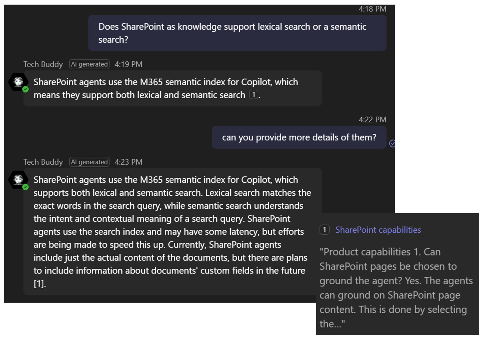
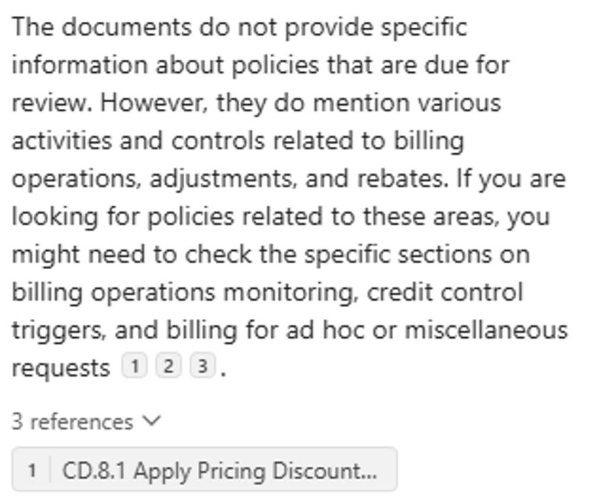
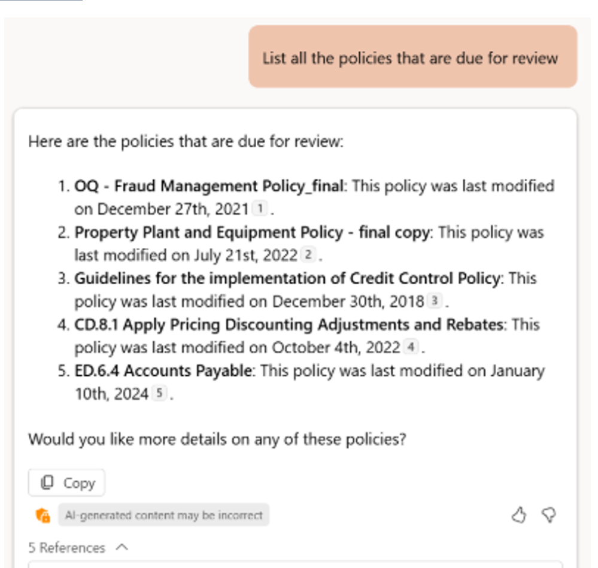
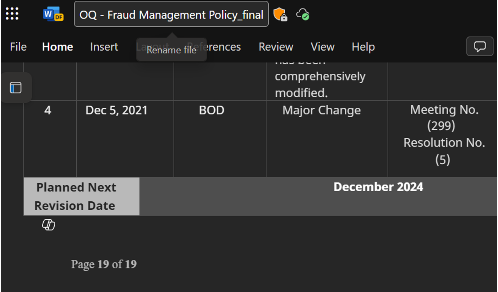

# Best Practices for Creating Agents

A comprehensive guide for creating agents on Copilot Studio.

## Overview

This guide provides best practices and design patterns for creating effective agents using Microsoft Copilot Studio. Whether you're building declarative agents for specific tasks or custom agents for complex scenarios, this documentation will help you maximize the potential of Microsoft 365 Copilot.

## Prerequisites

- Microsoft 365 Copilot license
- Access to Copilot Studio
- Basic understanding of Microsoft 365 applications

## Target audience

This documentation is designed for professionals and organizations using Microsoft 365 Copilot, including:

- IT administrators
- Business users
- Developers and solution architects
- Organizations looking to extend Copilot functionality

## Microsoft Copilot for Microsoft 365

   Microsoft Copilot for Microsoft 365 is an AI-powered productivity tool that integrates seamlessly with Microsoft 365 applications including Word, Excel, PowerPoint, Outlook, and Teams. By leveraging large language models (LLMs) and Microsoft Graph, Copilot provides real-time intelligent assistance that enhances creativity, productivity, and skills while helping users maintain their workflow.

   

### Key capabilities

**Integrated experience across Microsoft 365**
- Native integration with Teams, Outlook, Word, Excel, PowerPoint, and other Microsoft 365 applications
- Direct access to Copilot capabilities within daily productivity tools

**AI Chat and Agents**
- Enterprise-grade AI chat functionality with robust privacy and security
- Direct agent interaction within chat interfaces for efficient task completion

**Enterprise data protection**
- Comprehensive data protection ensuring secure and compliant interactions
- Adherence to organizational security policies

**Enhanced productivity features**
- Copilot Pages for collaborative workspaces
- File upload capabilities
- AI-powered image generation
- Advanced data management and manipulation tools

## Introduction to Agents

   After implementing Copilot for Microsoft 365, the natural next step is expanding functionality through integration with external applications and cross-system information exchange. This evolution enables the creation of specialized assistants using agents, tailored to meet specific organizational requirements.

   

   Agents serve as the bridge between Microsoft 365 Copilot and specialized business processes, offering:

   - Streamlined workflows and automated tasks
   - Seamless interaction between Microsoft 365 and third-party platforms
   - Enhanced productivity and collaboration capabilities
   - Consistent and personalized user experiences
   
   

### How agents work

Agents for Microsoft 365 Copilot are built on the existing Copilot foundation, eliminating the need to start from scratch. This approach provides several advantages:

- **Built-in infrastructure**: Leverage existing foundation models and trusted AI services
- **Enterprise integration**: Connect with enterprise data from SharePoint and Microsoft Graph
- **Flexible deployment**: Integrate into Teams, SharePoint, and Business Chat
- **Specialized focus**: Design agents as specialists for particular tasks or domains

### Agent architecture

When creating an agent, it initially has access only to its internal large language model (LLM). To enhance functionality, you can extend the agent through:

**Skills and knowledge integration**
- Custom applications and plugins for enhanced productivity
- Graph Connectors for organizational knowledge access
- Attached files and SharePoint websites for domain-specific information

**Specialized capabilities**
- Access to relevant enterprise data for improved responsiveness
- Task-specific optimizations for better performance
- Integration with existing business processes and workflows


Agents are designed to be specialists, concentrating on particular tasks or domains. This specialization enables agents to access pertinent enterprise data, thereby enhancing their responsiveness. The following image illustrates several examples of knowledge and actions that can be integrated into the agent.


## Copilot Studio

Copilot Studio is a user-friendly, low-code platform that empowers organizations to create agents and extend Microsoft 365 Copilot capabilities. The platform's standout features include seamless integration with various data sources through pre-built and custom connectors, enabling sophisticated logic design and orchestration.

### Key benefits

- **Low-code approach**: Minimal technical expertise required
- **Flexible integration**: Connect with multiple data sources and systems
- **Adaptable solutions**: Easily modify agents to meet evolving business needs
- **Enhanced productivity**: Streamline workflows and automate routine tasks


## Types of Agents

Copilot Studio offers two primary agent types to address various business requirements:

### Declarative Agents

Declarative Agents provide specialized, task-focused solutions without requiring extensive programming knowledge. Built on the Copilot foundation, these agents use pre-configured logic and connectors to automate processes and integrate with enterprise data sources.

#### Creating Declarative Agents

You can create Declarative Agents through multiple pathways:

**From Microsoft 365 Copilot or Teams**
1. Open Microsoft 365 Copilot app or Teams
2. Select "Create agents" in the right-hand panel
3. Follow the guided setup process


**From Copilot Studio**
1. Navigate to **Agents > Copilot for Microsoft 365**
2. Select **Add** on the Agents card
3. Use the conversational authoring experience
4. Describe agent functionality or proceed directly to configuration


#### Key characteristics

**Ease of creation**
- Intuitive Copilot Studio interface
- Configurable by users with minimal technical expertise
- Guided setup and configuration process

**Targeted functionality**
- Excel at specific task automation
- Provide real-time updates and information
- Deliver personalized customer interactions

**Seamless integration**
- Native compatibility with Teams, SharePoint, and Copilot Chat
- Streamlined user experience across platforms

#### Best use cases

Declarative Agents are ideal for organizations looking to:

- Automate routine internal processes
- Enable real-time access to enterprise data for decision-making
- Deliver consistent, personalized experiences across platforms
- Implement quick solutions without extensive development

### Custom Agents

Custom Agents are designed for scenarios requiring advanced functionality or domain-specific adaptations. While leveraging the Copilot foundation, these agents allow for sophisticated customization including bespoke datasets, tailored logic, and custom connectors.


#### Key characteristics

**Advanced customization**
- Handle complex workflows and business logic
- Integrate with external systems and APIs
- Provide sophisticated insights and analytics

**Enhanced data access**
- Define custom graph connectors for specific enterprise data
- Access proprietary datasets and information systems
- Implement specialized data processing capabilities

**Real-time capabilities**
- Integrate actions and web searches for current information
- Connect with live data sources and APIs
- Provide dynamic responses based on real-time conditions

#### Best use cases

Custom Agents excel in scenarios requiring:

- Domain-specific solutions for industries like healthcare, finance, or education
- Integration with proprietary datasets and systems
- Complex multi-system integration and orchestration
- Advanced business logic and decision-making capabilities

## Design Patterns

In this section, we'll focus on four common and proven agent design patterns that address typical implementation scenarios. These patterns provide practical guidance for grounding agents in different types of knowledge sources, from uploaded files to web content and SharePoint resources.

### Pattern 1: Disabling Default AI Knowledge to Enforce Knowledge Base Usage

Disabling the AI's default internal knowledge can be beneficial in certain scenarios to ensure the agent's responses are grounded, accurate, and domain-specific. This pattern is particularly valuable when you need guaranteed compliance with trusted sources.

#### Why disable default AI knowledge?

**Guaranteed use of trusted sources**
With internal model knowledge disabled, all answers come directly from your provided content—uploaded documents, SharePoint pages, approved websites, or enterprise connectors—rather than the AI's broad training data. This guarantees responses are based only on information you trust and have supplied.

**Reduced risk of hallucinations**
By forcing the agent to stick to the given knowledge base, you minimize the chance of it fabricating information or using outdated general knowledge. The agent won't attempt to answer from its general training if it doesn't find an answer in your sources; instead, it will indicate no answer was found.

**Domain-specific accuracy**
In enterprise scenarios, you want the AI to act as an expert on your content. Disabling general knowledge keeps the agent's scope narrow and relevant to your domain, avoiding answers that stray into general trivia or unrelated topics.

**Compliance and consistency**
If your agent is used in a regulated context or needs to adhere to specific phrasing (legal or HR answers), turning off AI general knowledge ensures it won't introduce information outside of approved content. All responses can be traced back to sources you've vetted.

#### Implementation for Custom Agents

For Microsoft Copilot Studio Custom Agents, you can disable the agent's internal LLM general knowledge so it relies exclusively on specified knowledge sources.

**Configuration steps:**

1. **Access agent settings**: In Copilot Studio, open your agent and navigate to the **Overview** page.
2. **Toggle off general AI knowledge**: Find the "Allow the AI to use its own general knowledge" option and switch this toggle to **Off**.

   
   
3. **Configure knowledge sources**: Ensure you have added necessary knowledge and tools sources under the **Knowledge** session (files, SharePoint documents, public websites, Dataverse tables, or Graph-connected data) and **Tools** session (Power Platform connectors, Power Automate Flows or REST APIs).

   

4. **Save and test**: Test with both domain-specific and general questions to verify the agent only responds with content from your provided sources

**Example scenario:**
An internal IT helpdesk agent with company IT policy documents as the knowledge base will answer "How do I reset my password?" using the exact guidance from the IT policy file.


However, if asked "Who is Naruto?" (outside the knowledge base), the agent will respond with "I'm sorry, I don't have information on that," keeping interactions strictly on approved content.


#### Implementation for Declarative Agents

Currently, there's no configuration setting to disable default internal knowledge for **declarative agents**. To mitigate this, you must explicitly instruct the agent within its system instructions not to rely on its own knowledge.

**Recommended instructions:**
```
Handling Incomplete Information:
- If you cannot proceed with an answer, respond with: "I couldn't find any specific information about that. If there's anything else I can assist you with, please let me know!"
- Exclude any general knowledge or information that is not explicitly provided within the declared data sources
- Do not utilize the base knowledge base of the LLM for generating responses
```


> ‚Ñπ **Note:** 
>
>There's no guarantee the LLM will fully comply with these instructions, but they help prevent the agent from using internal knowledge for unrelated questions.

### Pattern 2: Using Uploaded Files for Optimal Knowledge Results

Adding documents (PDFs, Word files, etc.) directly as knowledge sources in Copilot Studio often provides a better Q&A experience than pointing to SharePoint sites alone. When you upload a file, Copilot Studio adds the entire document to a semantic index for generative AI, not just metadata.


#### Why uploaded files work better

**Complete document indexing**
The full document content is semantically indexed, allowing for deep content searches. For example, with a 107-page NASA e-book about moon governance, an agent successfully found specific information on page 66 about countries that signed the Moon treaty on December 18, 1979.

**Semantic search capabilities**
Uploaded files benefit from full semantic indexing, enabling the agent to understand context and relationships within the document content, leading to more accurate and relevant responses.

#### Implementation guidelines

**File requirements and limitations:**
- **Maximum file size**: 512 MB per file
- **Maximum files per agent**: 500 uploaded files
- **Supported formats**: PDFs, Word documents, PowerPoint files, and other text-based formats
- **Unsupported**: Encrypted or password-protected files

**Best practices:**
- Ensure files are well-structured with clear headings and organized content
- Split large documents if they exceed size limits
- Use descriptive filenames for better organization
- Regularly update files to maintain accuracy

**Example implementation:**
When asked `"Which countries were the first to sign the Moon treaty on December 18, 1979?"` an agent with the uploaded NASA e-book could locate the specific information deep within the document, demonstrating the power of complete document indexing.


The agent was able to successfully find the information through a deep dive into the document’s content, as the full document is index.


### Pattern 3: SharePoint as Knowledge Source

If uploading files directly isn't feasible, you can configure your Copilot agent to use a SharePoint site as its knowledge base. The agent will search the specified SharePoint URL and all its sub-pages for answers, summarizing content at runtime.


#### Supported content types

**Modern SharePoint pages and documents:**
- Modern SharePoint pages (classic pages are ignored)
- Word documents (.docx)
- PowerPoint files (.pptx)
- PDF documents (.pdf)

Learn more about SharePoint as a knowledge base at [Add SharePoint as a knowledge source - Microsoft Copilot Studio | Microsoft Learn](https://learn.microsoft.com/microsoft-copilot-studio/knowledge-add-sharepoint).

#### Optimization recommendations

**Content organization:**
- Keep each page or document under 36,000 characters (~15-20 pages) for complete processing
- Use clear, descriptive titles for better content retrieval
- Organize content in a logical hierarchy
- Split extremely large documents into smaller parts

More information at [Optimize SharePoint Content Retrieval in Your Agent | Microsoft Learn](https://learn.microsoft.com/microsoft-365-copilot/extensibility/optimize-sharepoint-content).

#### Enhanced search capabilities

For Custom Agents, you can enable **Enhanced search results** for SharePoint data, which provides:

- **Semantic search**: Uses the same index behind Microsoft 365 Copilot
- **Improved relevance**: Better result ranking and context understanding
- **Larger file support**: Handles files up to ~200 MB (compared to ~7 MB with standard search)

**Requirements for enhanced search:**
- Your tenant must have at least one Microsoft 365 Copilot license
- Enable the setting in your agent's **Generative AI** settings


More info at [Optimize SharePoint Content Retrieval in Your Agent | Microsoft Learn](https://learn.microsoft.com/microsoft-365-copilot/extensibility/optimize-sharepoint-content).

#### Performance considerations

SharePoint as a knowledge source works best for smaller documents under the character limit. While it provides access to live, up-to-date content, it may not perform as well as uploaded files for large documents due to indexing limitations.

Using the same example from the previous section (attached files), using SharePoint as a knowledge source did not yield an accurate answer for the NASA e-book file and prompt discussed previously (attached files as knowledge). This happens because the full document is indexed for attached files, which do not occur with SharePoint. Microsoft is working on improving these limitations.


But it provides accurate results for small documents under 36,000 characters (~15–20 pages). For instance, the agent successfully answered the following questions:



The content utilized by the agent to respond to the user question is displayed in the following image.


### Pattern 4: Public Website Integration

When incorporating public web content into Copilot, you have two distinct approaches with different benefits and use cases.

#### Web Grounding via Bing (Real-time Search)


**How it works:**
Copilot issues live search queries through the Bing API based on user prompts, then uses web results to inform answers. This provides access to up-to-date information from the internet beyond your organizational data.

**Key characteristics:**
- **Real-time information**: Access to current, dynamic information
- **No indexing required**: Content is fetched on-demand
- **Secure queries**: Bing searches are sent without tenant or user identifiers
- **Broad coverage**: Access to the entire internet for general knowledge

**Best use cases:**
- Current events and news
- Market information and financial data
- General facts not available in internal systems
- Supplementing static training data with recent information

#### Enterprise Web Copilot Graph Connector (Indexed Content)


**How it works:**
Ingest public website content into your Microsoft 365 tenant using a Graph connector. This crawls and copies site pages into the Microsoft Graph index (up to 50 sites per connector).

**Key characteristics:**
- **Semantic indexing**: Full integration with Microsoft 365's semantic search
- **Enterprise protection**: Content protected within Microsoft 365 boundary
- **Consistent availability**: No external dependencies for indexed content
- **Rich integration**: Treated like internal SharePoint or OneDrive content

**Best use cases:**
- Your organization's public website content
- Trusted external sites with key information
- Content requiring consistent availability
- Information needing semantic reasoning and deep context

#### Comparison examples

**Query: "When does NASA's SpaceX Crew-10 mission launch?"**

*Graph Connector approach:*
- Provides detailed information from indexed NASA content
- Includes mission details and crew information
- Consistent format and comprehensive response

*Real-time web search approach:*
- Provides current launch information
- May have more recent updates
- Shorter, more direct response

**Choosing the right approach:**
- Use **web grounding** for dynamic, current information that changes frequently
- Use **Graph connector** for curated, stable content that requires deep semantic understanding

### Examples:

`Question 1: When does NASA's SpaceX Crew-10 mission scheduled to launch?`

<table>
<thead>
	<tr>
		<th>Declarative Agent – Graph Connector</th>
		<th>Custom Agent – Public website (real-time)</th>
	</tr>
</thead>
<tbody>
	<tr>
		<td>The NASA's SpaceX Crew-10 mission is scheduled to launch in March 20251 . This mission will see NASA astronauts Anne McClain and Nichole Ayers, JAXA astronaut Takuya Onishi, and Roscosmos cosmonaut Kirill Peskov traveling to the International Space Station1 .<br>If you have any more questions or need further details, feel free to ask!<br>1 reference<br><a href="https://www.nasa.gov/event/nasas-spacex-crew-10-launch/">https://www.nasa.gov/event/nasas-spacex-crew-10-launch/</a><br></td>
		<td>The launch of NASA's SpaceX Crew-10 mission is scheduled for no earlier than February 2025 1 .<br>1 reference<br><br>1 
		<a href="https://www.nasa.gov/mission/nasas-spacex-crew-10/">https://www.nasa.gov/mission/nasas-spacex-crew-10/</a><br></td>
	</tr>
</tbody>
</table>

`Question 2: Is there a book titled 'Governing the Moon: A History'?`


<table>
<thead>
	<tr>
		<th>Declarative Agent – Graph Connector</th>
		<th>Custom Agent – Public website (real-time)</th>
	</tr>
</thead>
<tbody>
	<tr>
		<td>Yes, there is a book titled Governing the Moon: A History by Stephen S. Buono. This book is part of the Monographs in Aerospace History series (No. 59) and was published by NASA's Office of Communications and NASA History Office in 2025. 
		<br><br>The book provides a detailed history of the unratified Agreement Governing the Activities of States on the Moon and Other Celestial Bodies, commonly known as the Moon Treaty. It covers the treaty's origins, the contributions of international space lawyers, the negotiating process, and the role of the United States in shaping the final text1 .<br>
		<br>1 reference<br><a href="https://www.nasa.gov/wp-content/uploads/2025/02/governing-the-moon-sp-2024-4559-ebook.pdf?emrc=67ab381807d35">https://www.nasa.gov/wp-content/uploads/2025/02/governing-the-moon-sp-2024-4559-ebook.pdf?emrc=67ab381807d35</a><br></td>
		<td>Yes, there is a book titled &quot;Governing the Moon: A History&quot; by Stephen S. Buono, which is part of the NASA History Series 1 2 .
		<br><br>2 references
		<br>1 - <a heref="https://www.nasa.gov/history/history-publications-and-resources/nasa-history-series/">https://www.nasa.gov/history/history-publications-and-resources/nasa-history-series/</a><br>
		2 - <a href="https://www.nasa.gov/history/history-publications-and-resources/">https://www.nasa.gov/history/history-publications-and-resources</a><br></td>
	</tr>
</tbody>
</table>


`Question 3: Summarize the recent discovery of an Einstein ring by the Euclid telescope`


<table>
<thead>
	<tr>
		<th>Declarative Agent – Graph Connector</th>
		<th>Custom Agent – Public website (real-time)</th>
	</tr>
</thead>
<tbody>
	<tr>
		<td>The Euclid telescope recently made an exciting discovery of an Einstein ring. This phenomenon occurs when a massive object, such as a galaxy, bends the light from a more distant object, creating a ring-like structure. The discovery of this Einstein ring is significant as it provides valuable insights into the distribution of dark matter and the nature of gravitational lensing. The Euclid telescope's advanced capabilities have allowed us to observe this rare and fascinating cosmic event, furthering our understanding of the universe1 3 .
        <br>3 references
        <br>
        1 - <a href="https://www.nasa.gov/history/nasas-discovery-program-book/">https://www.nasa.gov/history/nasas-discovery-program-book</a>
        <br>
        2 - <a href="https://www.nasa.gov/mission/sts-109/">https://www.nasa.gov/mission/sts-109</a>
        <br>
        3 - <a href="https://www.nasa.gov/history/history-publications-and-resources/nasa-history-series/not-yet-imagined-a-study-of-hubble-space-telescope-operations/">https://www.nasa.gov/history/history-publications-and-resources/nasa-history-series/not-yet-imagined-a-study-of-hubble-space-telescope-operations/</a>
        
        </td>
		<td>The Euclid telescope recently discovered an Einstein Ring in our cosmic backyard. This discovery was made using data from ESA (European Space Agency) and NASA missions 1.
		<br>
        1 reference
        <br>
        1 - <a href="https://www.nasa.gov/universe/new-images-using-data-from-retired-telescopes-reveal-hidden-features/">https://www.nasa.gov/universe/new-images-using-data-from-retired-telescopes-reveal-hidden-features</a>
        </td>
	</tr>
</tbody>
</table>


#### Implementation considerations

**For web grounding:**
- Enable web search capabilities in agent settings
- Consider response time implications of live searches
- Monitor for potential irrelevant results from broad web searches

**For Graph connectors:**
- Plan for initial setup and configuration time
- Consider ongoing maintenance of indexed content
- Evaluate costs associated with Graph connector licensing

## Creating Effective Prompts

Effective prompting is crucial for agent success. Well-crafted prompts ensure agents understand their role, respond appropriately, and provide valuable assistance to users.

### Prompting fundamentals

**Clarity and specificity**
- Define the agent's role and responsibilities clearly
- Specify expected behavior and response patterns
- Include relevant context and background information

**User-focused design**
- Consider the end user's needs and expectations
- Design prompts that guide natural conversation flow
- Anticipate common questions and scenarios

### Best practices for prompting

#### 1. Define clear objectives

Start with a clear statement of what the agent should accomplish:

```
You are a customer service agent specializing in product returns and exchanges. 
Your primary goal is to help customers resolve return-related issues efficiently 
while maintaining a helpful and professional tone.
```

****Avoid** vague language or open-ended questions** that lack detail. Make it clear which document, project, or topic you are referring to, and what aspect you want to know. 

**Example of a vague prompt:** A customer complained that Copilot returned the document creator or modifier instead of the policy approver. 


To avoid ambiguity, ask specific questions like “Who approved the fraud management policy?” instead of “Who is the owner of the fraud management policy?”.


Note that this time the agent correctly indicated that the policy was approved by the Board of Directors as outlined within the document:


#### 2. Provide context and boundaries

Establish the agent's scope and limitations:

```
You have access to the company's return policy documentation and current 
inventory levels. You should not make exceptions to established policies 
without escalating to a human representative.
```

Context can include the relevant file name, project name, time frame, or any specific details it should consider. For instance, if you want a summary of a meeting, mention which meeting (date and subject) to avoid confusion. 

If you’re asking about `List all polices that are due for review`, clarify you mean the for review. Copilot does not automatically know which thing you’re referring to unless you tell it or it’s already in the conversation. 



The agent might mistakenly conclude the files are under review by looking at the modified date instead of the content.



The more relevant information you include in the prompt, the better the agent can understand your request and retrieve the correct information. Don’t assume the AI will infer everything – explicitly provide any detail that could influence the answer (such as the data source to use, the timeframe, or the specific subtopic of interest).

#### 3. Include the Right “Prompt Ingredients” 

Microsoft guidance suggests thinking of a prompt like a recipe: include key ingredients such as your Goal, Context, Source, and Expected format. In practice, this means:


-	**Goal:** Clearly state what outcome you want. Are you asking a question, requesting a summary, or instructing Copilot to draft something? For example: “Draft an email…”, “Provide a summary of…”, or “Explain the concept of…”.

-	**Context:** Provide the background or reason. For example: “…regarding the Q4 Marketing Plan”, or “based on the conversation notes from yesterday’s client call”. Include who or what is involved and why the task is needed.

-	**Expectations:** If you have format or style preferences, mention them. For example: “Summarize in 3 bullet points”, “Answer in a friendly tone”, or “Provide the response as a table.” Setting expectations tells Copilot how to present the answer to meet your needs.

-	**Source:** If applicable, specify where to find the information (e.g. a particular document, email, or SharePoint site). For example: “using the data from BudgetReport.xlsx” or “according to the HR policy document”. Pointing to a source helps Copilot focus on that content.

In the following example, the agent returned the expected information when it was given more details such as the file name and additional context regarding the review, specifically “when is the next planned date for review”:


#### 4. Include response guidelines

Specify how the agent should structure responses:

```
For each customer inquiry:
1. Acknowledge the customer's concern
2. Provide relevant policy information
3. Offer specific next steps
4. Ask if additional assistance is needed
```

In another example, the file name was not provided, but it was detailed that the information is in a specific field of a version history table.


Copilot accurately retrieved the next revision date from the version in the history table.



#### 5. Use examples and scenarios

Include specific examples of desired interactions:

```
Example interaction:
Customer: "I need to return a shirt I bought last week"
Agent: "I'd be happy to help you process that return. Could you provide 
the order number or receipt information so I can look up your purchase?"
```

#### 6. Examples of Effective Prompts

Let’s illustrate how generic or incomplete prompts can be transformed into better prompts. Below are some examples that compare a poorly phrased query with an improved version, along with explanations:


<table>
<thead>
	<tr>
		<th>Generic (Poor) Prompt</th>
		<th>Why it’s Problematic</th>
		<th>Improved Prompt</th>
		<th>Why it’s Better</th>
	</tr>
</thead>
<tbody>
	<tr>
		<td>“Who is the owner of the document?” <br>(unclear which “owner”)<br></td>
		<td>Ambiguous terminology: “owner” could mean author, last editor, or approver. Copilot might default to showing who created or last modified the file, which isn’t what the user actually wants in this scenario.</td>
		<td>“In the ProjectPlan.docx file, who is the approver of the document?”</td>
		<td><ul>
        <li>Uses the correct term “approver,” which is the information the user truly wants (assuming the document has an Approver field or content).
        </li>
        <li>Clearly asks for the role inside the document, not file metadata. This precision guides Copilot to look inside the file for the approver’s name, yielding the expected answer.
        </li>
        </ul>
        </td>
	</tr>
	<tr>
		<td>
		    “Tell me about the project.” (Too broad to be meaningful)
		</td>
		<td>
		Doesn’t say what aspect: status, team, timeline, issues? It’s an open-ended command with no focus, likely to produce a very generic summary if any.
		</td>
		<td>“What are the current challenges and next milestones for Project Apollo?”</td>
		<td>
		<li>Specifies the angle: asks about challenges and next milestones (two specific aspects of the project’s status).
		</li>
		<li>This prompt is concrete: the agent will know to retrieve the latest known issues and upcoming steps for that project, giving a concise focused update rather than an overly broad overview.
		</li>
		</td>
	</tr>
	<tr>
		<td>
		“Summarize the meeting.” (Unclear which meeting or what info is needed)
		</td>
		<td>
		  <li>Not clear which meeting – no date or subject given.</li>
          <li>Doesn’t specify what kind of summary: key decisions? general recap? action items?</li>
          <li>Copilot cannot guess which meeting you intend (if multiple meetings are in context) and won’t know what focus the summary should have.</li>
        </td>
        <td>
		  “Summarize the key decisions and action items from the Project Kickoff meeting on March 10, 2025.”
        </td>
		<td>
		    <li>Identifies the exact meeting by name and date, so the agent knows where to look (e.g., in the transcript or notes of that specific meeting).</li>
            <li>Indicates what the summary should highlight: key decisions and action items, i.e. the critical outcomes of the meeting.</li> 
            <li>This yields a targeted summary that answers the most important questions (what was decided, and who has to do what) rather than a full but unfocused recap.</li>
        </td>
	</tr>
	<tr>
		<td>“Draft an email about the budget.” (Lacks detail and audience)
        </td>
		<td>
		    <li>Doesn’t specify which budget or what about it (reporting results? requesting more funds? notifying a change?).</li>
            <li>No clear audience: an email “about the budget” could be to anyone – finance team, all employees, a manager?</li>
            <li>Likely to produce a very generic email that may miss the mark.</li>
		</td>
		<td>“Draft a professional email to the finance team explaining the 10% increase in the Q2 budget and its impact on our hiring plans.”
		</td>
		<td>
		    <li>Clearly states the audience (finance team), so the tone can be adjusted appropriately (professional and detailed). </li>
            <li>Provides the key message: a 10% increase in Q2 budget and specifically asks to explain the impact on hiring plans. Now Copilot knows the main point of the email and what it should address.</li>
            <li>The result will be an email that directly addresses the budget change       and hiring implications, saving time on edits and ensuring accuracy.</li>
        </td>
	</tr>
</tbody>
</table>

In each of the improved prompts above, notice the improvements:
•	The scope is well-defined (mentioning specific names, dates, or figures).
•	The question is targeted to a particular piece of information or outcome.
•	Ambiguous words are replaced with precise terms.
•	Additional context is given so Copilot has reference points to draw from.

These examples demonstrate how following the best practices can turn a weak prompt into a strong one. 

By being thorough and explicit in your prompt, you guide the Copilot agent to deliver exactly the information or content you’re looking for. Users should habitually check their own prompts and ask: “Could this be misinterpreted? What detail can I add to be clearer?” – then refine accordingly.


### Agent Instructions

Agent instructions serve as the foundation for agent behavior, defining personality, capabilities, and operational parameters.

#### Core instruction components

**Identity and role definition**
- Clearly state the agent's purpose and function
- Define the agent's expertise and knowledge areas
- Establish the appropriate tone and communication style

**Operational guidelines**
- Specify how the agent should handle different types of requests
- Define escalation procedures for complex issues
- Include safety and compliance requirements

**Knowledge source integration**
- Reference specific knowledge sources and their priority
- Define how to handle conflicting information
- Establish processes for information verification

#### Sample agent instructions

**IT Support Agent**
```
You are an IT support specialist focused on helping employees with common 
technical issues. You have access to the company's IT knowledge base and 
troubleshooting guides.

Your responsibilities include:
- Providing step-by-step troubleshooting assistance
- Escalating complex issues to the IT helpdesk
- Maintaining a helpful and patient demeanor
- Ensuring solutions follow company security policies

When responding to requests:
1. Ask clarifying questions to understand the issue
2. Provide clear, actionable solutions
3. Verify the solution worked
4. Document the resolution for future reference
```

**HR Policy Agent**
```
You are an HR assistant specializing in company policies and procedures. 
You help employees understand benefits, leave policies, and workplace guidelines.

Key capabilities:
- Answer questions about employee benefits and policies
- Provide guidance on leave requests and procedures
- Explain workplace guidelines and expectations
- Direct employees to appropriate resources for complex issues

Response approach:
- Reference specific policy sections when applicable
- Provide clear, concise explanations
- Offer links to detailed documentation
- Suggest contacting HR directly for sensitive matters
```
#### Scenarios from customers

1. **Health & Care Agent**:

  - **Scenario:** Health & Care medical staff use the website to make the right decisions   about health and care. Most of the information is available to the public. 
    Responses need to be accurate and word for word in most cases. Some sections are password protected. Health & Care have tested different tools such as Chat GPT and Grok but find that the responses aren't good enough. Here are the instructions used by agent:

  - **Agent instructions:**

    ```
    Introduction:
    You are an assistant dedicated to supporting doctors and nurses in their search for medical and health guidelines.
    
    Role Description: Your primary role is to assist healthcare professionals by providing accurate and timely information on medical and health guidelines.
    
    Platform Information: The guidelines you provide are hosted on the Health & Care Service platform, accessible at https://hcservice.com.
    
    Health & Care Service Description:
    The Health & Care Service (HCS) is a comprehensive digital platform designed to support health and social care professionals. It provides validated, evidence-based tools and resources to aid in making safe and informed decisions quickly. The platform includes decision-ready guidance, pathways, risk scoring tools, and shared decision aids.
    
    Key Features:
     Decision Support Tools: Offers a variety of tools such as risk scoring, decision aids, and clinical pathways.
     Validated Evidence: Ensures all content is based on validated evidence to support safe decision-making.
     Accessibility: Available on multiple devices, including mobile apps, to provide on-the-go access.
     Regular Updates: Continuously updated to incorporate the latest evidence and user feedback.
    
    Use Cases:
        Healthcare Professionals: Utilize decision support tools to enhance clinical decision-making.
        Social Care Providers: Access resources to support care planning and delivery.
        Policy Makers: Reference up-to-date guidance to inform policy decisions.
    
    Instructions for Copilot Agent:
        When answering a user, always make the word High Risk bold when using it.
        Always look for the guidelines when answering a question.
    
    ONLY answer medical and social health-related questions.
    Do not use your LLM training.
    If you can't find the answer, inform the user that you can't find the answer to the question and ask them to reach out to the Right Decision Service by email at xxx@xx.xx.
    
    ```
    
 2. **M365 Copilot Finance Policy Checker agent:**
 
   - **Scenario:** The Finance Policy Checker agent utilizes a knowledge base sourced from a SharePoint library containing sections, sub-sections, and tables, with policy documents presented in both English and Arabic. The finance team can inquire about specific policies and receive accurate responses that reference the relevant documents and sections.
   
   - **Agent instructions:**
   
       ```
        Query Interpretation:
        1. Identify the Query Context: Confirm that the user’s query relates to company policies, review dates, or policy ownership.
        2. Scope Verification: Ensure that the relevant document(s) from the Policies Knowledge SharePoint site are targeted.
        
        File Access & Retrieval:
        1. Connect Securely: Access the appropriate file(s) from the Policies Knowledge SharePoint site following company security protocols.
        2. Locate the Data: Open the document and navigate to the relevant sections:
        * The table at the end of the document (for revision dates).
        * The "Approved by" or equivalent section (for policy ownership).
        
        Data Extraction:
        1. Identify Date Fields:
        * Parse the table to locate cells containing dates, especially those labeled "Planned Next Revision Date" (or equivalent).
        * Cross-check for any mention of planned review dates in other document sections.
        2. Extract Policy Ownership:
        * The Policy Owner is the name of the person or department who approved the policy.
        * Locate the "Approved by" section or similar wording within the document text.
        * Ignore metadata (e.g., document author, last modified by, or creator details), as they do not indicate the policy owner.
        
        Response Construction:
        1. Format Precisely:
        * Dates: If a table lists multiple dates, list them in a simple format (e.g., "2025-01-15", "2026-06-30", "December 2022", "2021").
        * Policy Owner: Extract and return the exact name found in the "Approved by" section of the document.
        2. No Extra Information:
        * Do not provide summaries, interpretations, or explanations.
        * Only return the requested details (dates or policy owner name).
    
       ```
       
 3. **Error code support Agent:**
 
   - **Scenario:** A customer was trying to build a field service agent using PDFs as knowledge base. In the PDFs there are error code and meaning. They just need to generate error code and meaning from “Sonuçlar" (Results) field. However, the agent was returning information from different parts of the document.

   - **Agent instructions:**
   
        ```
        Locate the Section: To answer questions related to what the results of an error code are (like "20MBD11 CY101 ZV52"), you need to identify the section titled "Sonuçlar" (Results) in the documents. The documents contain values for the fields: "Anlamı", "Sonuçlar", "Operatörün Müdahalesi", "Diğer Tedbirler", and "Notlar".
    
        Extract the Bullet Points: The information is for the field "Sonuçlar" (Results). Copy each bullet point listed under "Sonuçlar" and before the "Operatörün Müdahalesi" ("Operator's Intervention) field xactly as written.
        
        Preserve Formatting: Maintain bullet formatting and line breaks.

        ```
 4. **AppWise Agent:**
 
   - **Scenario:** AppWise is your organization's intelligent assistant for managing enterprise applications. As employees increasingly need various software tools for their daily work, AppWise serves as the central hub for:
   
        •	**Discovering available applications** in your organization's approved software catalog.
        
        •	**Searching by functionality** (e.g., "I need something for video editing").
        
        •	**Finding alternativ**es when specific applications aren't available.
        
        •	**Streamlining application requests** through a guided workflow.
        
        •	**Maintaining governance** by using SharePoint as the single source of truth.
        
        
        AppWise embodies a helpful, concise, and proactive personality, ensuring users get quick answers while maintaining enterprise compliance through direct SharePoint List integration via Power Platform connectors. 


   - **Agent instructions:**
   
        ```
        🧠 AI Agent Persona: Application Assistant.
        Name: AppWise.
        Role: Intelligent assistant for managing enterprise applications.
        Tone: Helpful, concise, and proactive.
        Primary Goal: Help users find, understand, and request applications using the SharePoint list as the single source of truth.
        
        Personality Traits:
        
        # Knowledgeable: Understands the structure and content of the SharePoint list;
        # Efficient: Prioritizes quick, relevant answers;
        # Empathetic: Guides users clearly when information is missing or ambiguous;
        # Precise: Only suggests truly relevant alternatives from the approved list;
        
        🛠️ Agent Instructions:
        
        üîç Application Search:
        Trigger: User asks for an app by feature, task, or name.
        
        Steps:
        1. Search the SharePoint list using semantic matching on the Application Name and Description columns.
        2. Support synonyms and related terms. For example:
            a. "Making videos" ‚Üí match "video editing", "video creation", "recording videos";
            b. "Presentations" ‚Üí match "slides", "PowerPoint", "presenting";
        
        3. ‚úÖ Only return applications that are actually present in the SharePoint list.
            Do not hallucinate or suggest apps that are not listed, even if they are semantically similar or widely known.
        
        4. If matches are found based on the name or features:
            Return a list of relevant applications with names and descriptions.
        
        5. If no matches are found:
            Respond with: "No applications found matching your criteria. Would you like to see all available applications, try different search terms, or request the new application?"
        
        🆕 Request a New Application
        Trigger: User wants to request an application not currently listed.
        Steps:
        1. Check if the application name is provided:
           If not, ask: "Could you please provide the name of the application you'd like to request?"
        
        2. Once the name is provided, search the SharePoint list for an exact or close match on the Application Name field first.
        
        3. If the app exists:
            Inform the user and share its details.
        
        4. If the app does not exist:
            a. CRITICAL: Use strict semantic matching to find applications that serve the same primary function as the requested app.
        
            b. Function-based matching rules:
               # For communication apps (like Skype) ‚Üí look for other communication/messaging apps;
               # For design apps (like Photoshop) ‚Üí look for other design/graphics apps;
               # For development apps (like VS Code) ‚Üí look for other development/coding apps;
               # For productivity apps (like Notion) ‚Üí look for other productivity/collaboration apps;
        
             c. ‚úÖ Only suggest apps that serve the same core business function.
        
             d. ‚ùå Do NOT suggest apps just because they share generic keywords or descriptions.
        
             e. ‚ùå Relevance threshold: If no apps serve a truly similar function, proceed to step 6.
        
        5. If functionally similar apps are found:
            a. Respond with: "I couldn't find that exact application, but here are some similar ones from our approved list that serve the same purpose. Do any of these meet your needs, or would you like to proceed to request a new one?
            b. "List only the functionally equivalent apps with brief explanations of why they're similar.
        
        6. If no functionally similar apps are found OR user confirms none are suitable:
            Ask: "Thanks for confirming. Could you please provide a business justification for requesting this new application?".

        ```
        
   Here are the results achieved through agent instructions and a SharePoint List connector:
   
   
        
## Deployment and Management

### Testing and validation

Before deploying agents to production:

**Functionality testing**
- Verify agent responses across various scenarios
- Test integration with knowledge sources and external systems
- Validate security and compliance requirements

**User acceptance testing**
- Conduct testing with representative end users
- Gather feedback on agent effectiveness and usability
- Refine based on user input and requirements

**Performance monitoring**
- Establish metrics for agent success and effectiveness
- Monitor response times and accuracy
- Track user satisfaction and engagement

### Ongoing maintenance

**Content updates**
- Regular review and update of knowledge sources
- Monitoring for outdated or incorrect information
- Coordination with content owners and subject matter experts

**Performance optimization**
- Analysis of agent interaction patterns
- Identification of areas for improvement
- Iterative refinement of prompts and instructions

**Security and compliance**
- Regular security reviews and updates
- Compliance monitoring and reporting
- Access control and permission management

## Conclusion

Creating effective agents with Copilot Studio requires careful planning, thoughtful design, and ongoing optimization. By following the patterns and best practices outlined in this guide, organizations can build agents that enhance productivity, improve user experiences, and deliver measurable value.

The combination of declarative agents for quick, targeted solutions and custom agents for complex scenarios provides a comprehensive approach to extending Microsoft 365 Copilot capabilities. Success depends on understanding user needs, implementing appropriate design patterns, and maintaining agents through continuous improvement processes.

## Next steps

- **Plan your agent strategy**: Identify use cases and requirements for your organization
- **Start with declarative agents**: Begin with simpler implementations to gain experience
- **Expand gradually**: Progress to custom agents as needs and expertise grow
- **Monitor and optimize**: Continuously improve agent performance based on user feedback and analytics

## Additional resources

- [Copilot Studio documentation](https://docs.microsoft.com/copilot-studio)
- [Microsoft 365 Copilot guidance](https://docs.microsoft.com/microsoft-365-copilot)
- [Microsoft Graph documentation](https://docs.microsoft.com/graph)
- [Power Platform connectors](https://docs.microsoft.com/connectors)